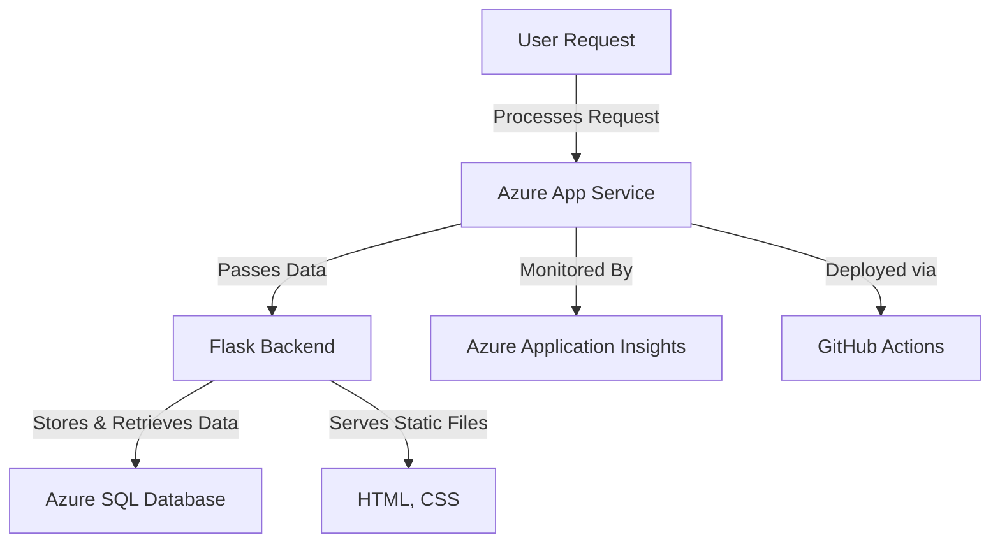

# Product Catalogue Application - README

## 1. System Architecture

The architecture follows a cloud-based deployment model using Microsoft Azure. The key components include:

- **Frontend:** HTML, CSS (Rendered using Flask)
- **Backend:** Flask (Python) for handling requests
- **Database:** Azure SQL Database for product storage
- **Cloud Deployment:** Hosted on Azure App Service
- **CI/CD:** GitHub Actions for automated deployment
- **Monitoring:** Azure Application Insights for real-time tracking and logging

## 2. Block Diagram

## 3. Application Deployment & Access

### 3.1 Deployment Steps

1. Develop the Flask application and configure it with Azure SQL Database.
2. Store database credentials securely in Azure App Settings.
3. Push the code to GitHub and configure GitHub Actions for automated deployment.
4. Deploy the application on Azure App Service.
5. Monitor logs and performance using Azure Application Insights.

### 3.2 URL to Access the Application

[Your Azure App Service URL]

*Example:* `https://yourapp.azurewebsites.net` (Replace with your actual deployment URL)

## 4. Future Enhancements

- Implement **user authentication** to restrict access to product management features.
- Enhance **search functionality** with filtering options like price range and categories.
- Integrate **AI-based product recommendations** using Azure Cognitive Services.
